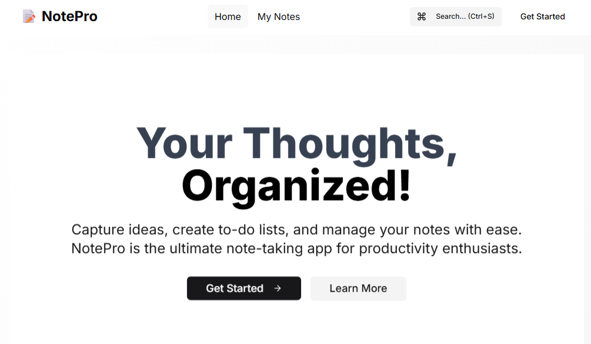
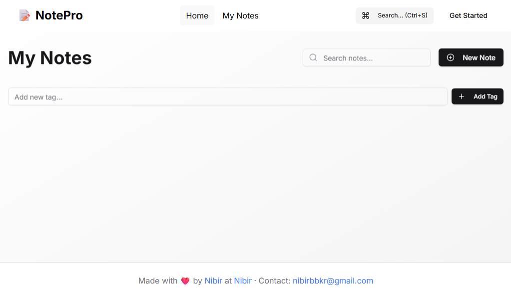
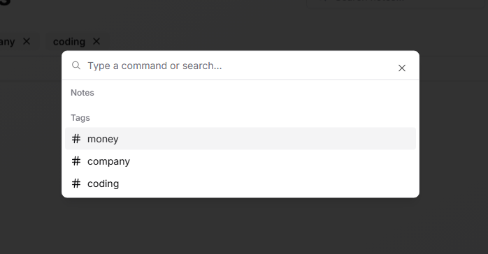

# NotePro

A minimal, modern note-taking web app focused on speed, clarity, and everyday productivity.

---

## Screenshots

**Landing Page**



**Note Taking**



**Search Tags**



---

## Overview

NotePro is built for individuals and professionals who value a distraction-free, high-performance note-taking experience. The interface is intentionally clean, with smooth interactions and practical features for managing notes, categories, and tags. Advanced search and filtering make it easy to find information quickly, while a responsive design ensures usability across devices.

## Tech Stack

- **React 18** – Component-based UI
- **TypeScript** – Type safety and maintainability
- **Vite 5** – Fast build and development tooling
- **Tailwind CSS** – Utility-first styling
- **Radix UI Primitives** – Accessible UI components
- **Framer Motion** – Smooth animations

## Getting Started


### Prerequisites

- Node.js 18 or higher
- npm 9 or higher

### Installation

Clone the repository and install dependencies:

```bash
npm install
## Build for Production

To create a production build:

```bash
npm run build
```

The optimized output will be generated in the `dist` folder.
npm run dev
```

Visit [http://localhost:5173](http://localhost:5173) to view the app in your browser.

## Available Scripts

- `npm run dev` – Start development server
- `npm run build` – Create production build
- `npm run preview` – Preview production build locally
- `npm run lint` – Run ESLint


```bash
npm run build
```

The output is generated in the dist folder.

## Project Structure

```
src/
  components/    # UI and feature components
  lib/           # Shared utilities
  assets/        # Static assets
```

## Features

- Fast, responsive, and minimalistic UI
- Rich text note editor
- Category and tag management
- Powerful search and filtering
- Keyboard shortcuts and command menu
- Accessible and mobile-friendly design
- Professional black-and-white iconography
- Error handling and input validation throughout

## License

This project is licensed under the MIT License. See the [LICENSE](LICENSE) file for details.

---

## Contact

For questions, feedback, or business inquiries, please contact:

**Nibir**  
Email: [nibirbbkr@gmail.com](mailto:nibirbbkr@gmail.com)

---
